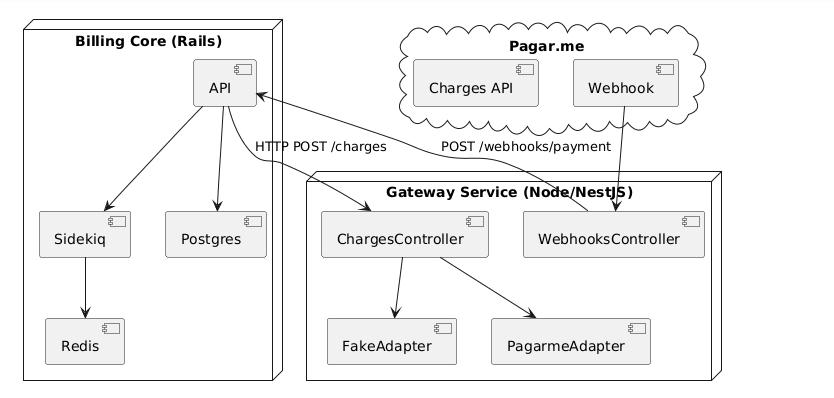
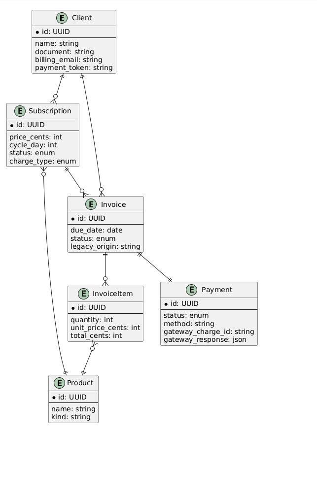
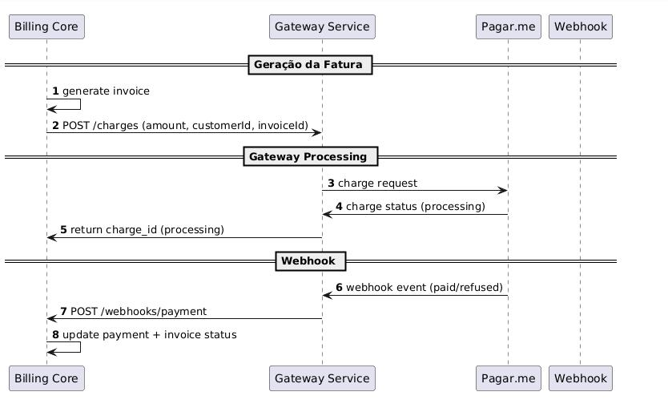

# Billing Platform — Rails + Node + Docker  
**Autor:** Gabriel Flauzino Mota  
**Objetivo:** Unificar cobrança utilizando Pagar.me como gateway principal, substituindo ASAAS, garantindo suporte a múltiplos produtos e múltiplos modelos de cobrança.

---

# 🚀 Visão Geral

Este projeto demonstra uma arquitetura completa e escalável para uma **Plataforma de Billing**, composta por:

| Serviço | Tecnologia | Função |
|--------|------------|--------|
| **Billing Core** | Ruby on Rails | Domínio financeiro (clientes, assinaturas, faturas, pagamentos) |
| **Gateway Service** | Node (NestJS) | Abstração de gateway de pagamento + integração Pagar.me |
| **Sidekiq** | Ruby | Jobs de cobrança, retries, geração recorrente |
| **Postgres** | Banco | Dados do billing |
| **Redis** | Cache + filas | Sidekiq / PubSub |
| **Docker Compose** | Infra | Orquestração |

---

# 🧱 Arquitetura


### Fluxo simplificado:

1. Rails gera Fatura → cria Payment (status: processing)
2. Rails chama Gateway (Node) `POST /charges`
3. Gateway chama Pagar.me (real ou fake)
4. Pagar.me envia webhook ao Gateway
5. Gateway traduz e avisa Rails `POST /api/v1/webhooks/payment`
6. Rails atualiza fatura e pagamento

---

# 🏗 Domain-Driven Design (DDD light)

### Entidades Principais:

```
Client
Subscription
Product
Invoice
InvoiceItem
Payment
```

### Relações:

- Cliente possui Assinaturas
- Assinatura pertence a Produto
- Assinatura gera Faturas
- Fatura tem vários Itens
- Fatura tem um Pagamento
- Pagamento é processado pelo Gateway

Diagrama ERD:


---

# 💳 Integração Gateway (Node)

A plataforma usa padrão Adapter:

```
PaymentGatewayAdapter
  ├── FakeGatewayAdapter (default)
  └── PagarmeGatewayAdapter (real)
```

Troca via:

```
USE_FAKE=true
```

---

# 🍃 API (Rails)

### Clients
```http
POST /api/v1/clients
GET /api/v1/clients/:id
```

### Subscriptions
```http
POST /api/v1/subscriptions
PATCH /api/v1/subscriptions/:id/cancel
```

### Invoices
```http
GET /api/v1/invoices/:id
```

### Webhooks (Gateway → Rails)
```http
POST /api/v1/webhooks/payment
```

---

# 🐳 Como rodar tudo

```
docker-compose up --build
```

Acessos:

- Rails: http://localhost:3001
- Gateway: http://localhost:3002
- Postgres: localhost:5432
- Redis: localhost:6379

---

# 🔄 Migração ASAAS → Pagar.me

Ver: `scripts/migrate_asaas_to_pagarme.md`

Resumo:

1. Exportar dados ASAAS
2. Criar clientes em Rails
3. Retokenizar cartões no Pagar.me
4. Criar assinaturas no Rails
5. Migrar faturas em aberto
6. Executar conciliação
7. Desligar ASAAS

Script de import: `scripts/import_asaas.rb`

---

# 🧪 Postman Collection

Arquivo: `postman/billing-platform.postman_collection.json`

Inclui:

- Criar cliente
- Criar produto
- Criar assinatura
- Gerar fatura
- Iniciar cobrança
- Simular webhook
- Verificar pagamento

---

# 📌 Bonus entregues

✔ Fatura com múltiplos produtos  
✔ Versionamento de API  
✔ Arquitetura pronta para multi-gateways  
✔ Entregue em Docker  
✔ Design pensando em produto independente  

---

# 🧩 Próximos passos (evolução natural)

- Billing analytics (MRR, churn, ARPA, LTV)
- Suporte a cupons
- Split de pagamentos
- Suporte Stripe/Adyen via novos adapters
- Dashboard administrativo

---

## Deployment Architecture


## Domain Model (ERD)


## Sequence Diagram (Billing Flow)

